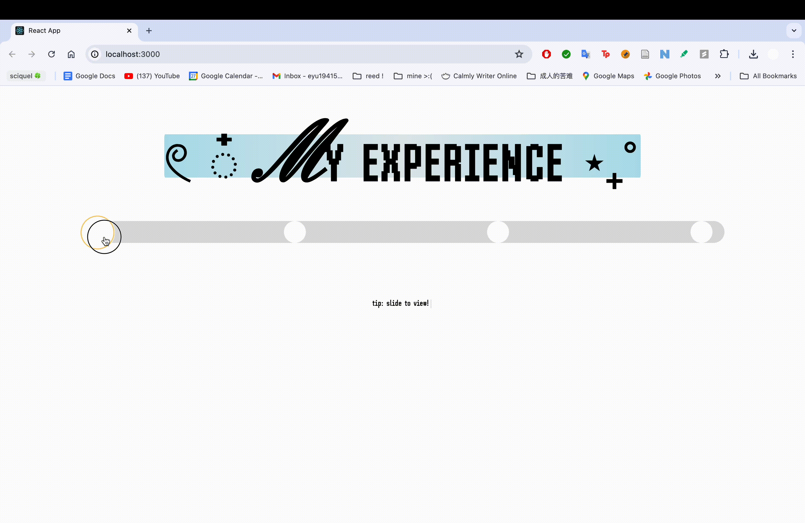

## 👩🏻‍💻 DESCRIPTION
Welcome to `my-cv-website 🧊`, a.k.a. my personal website/digital portfolio! This was initially created in 2024 in order to independently expand upon the React.js skills I was learning in my Web Development internship at SciQuel (which I previously had no experience in) & generally grow my understanding of WebDev concepts (such as responsive design, UI/UX, etcetera.). 

I created my website primarily with React.js, HTML, and CSS. I also employ various JavaScript libraries/APIs, such as [**TypewriterJS**](https://github.com/tameemsafi/typewriterjs#readme), [**ReactSlider**](https://zillow.github.io/react-slider/) (with inspiration from this [**tutorial**](https://blog.logrocket.com/react-slider-tutorial/)), [**ShowdownJS**](https://github.com/showdownjs/showdown), and Intersection Observer.

Enjoy!

⬇️ Opening still of `my-cv-website`

<br>

## 📦 INSTALLING AND RUNNING
1. Open via [**GitHub pages link**](https://00eemsy.github.io/my-cv-website/)

Or

1. From [**00eemsy/my-cv-website**](https://github.com/00eemsy/my-cv-website), download all of the files with the `<> CODE` button. These files include:
   * the `node_modules` folder, which includes npm packages necessary for this website to run
   * the `public` folder, which includes:
      * the `readMes` folder, which is embedded in the `projects.jsx` section of this website
      * the `visuals` folder, which supplements the READMEs with images/gifs
      * ... and more!
    * the `src` folder, which includes:
      * the `components` folder, which are the different sections of the website
      * ... and more!
    * ... and more!
2. Using your preferred console, type the following:
```
npm run start
```
4. If not already automatically prompted, open the following link on your preferred browser: [**https://localhost:3000**](https://localhost:3000)

## 🎮 DEMOS

_Typewriter loads on scroll_


_Using the slider in `experience.jsx`_


_Using the buttons in `projects.jsx`_

